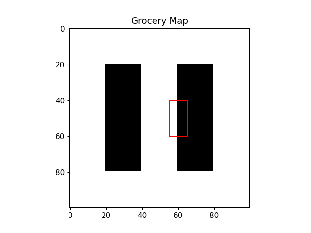

# Shelfhelp Dino
### This repository contains code that uses a finetuned DINO model by Meta, YOLOv5, and KMeans algorithm to represent grocery store images as a distribution of products. 

## Background and Objective
- This work is part of my independent study for Fall 2023. 
- The primary objective was to use the distributions obtained from finetuned Dino model to improve the resampling stage of Monte Carlo Localization. 
- Features obtained from images are embedded on the map. When the user walks around the store, these embeddings can be used to better localize the user in the store. (see figure 1a and b)

<figure>

<b><figcaption>Figure 1a: shelf image</figcaption></b>
</figure>

<figure>

<b><figcaption>Figure 1b: shelf distribution image</figcaption></b>
</figure>

## DINO
- DINO is a framework to train a self-supervised model to learn representations from images. 
- It consists of a student and teacher network.
- It employs a multi-crop strategy to train the model. Multiple views of the same image are created at different scales and passed to the student and teacher network. The student network learns to capture the global view of the image from the local views.
- The parameters of the teacher network are updated using the exponential moving average of the student network.
- The loss is cross-entropy of the embeddings predicted by the student and the teacher network. This is used to update the parameters of the student network.
- Figure 2 shows the architecture of the model.

<figure>

<b><figcaption>Figure 2: DINO</figcaption></b>
</figure>

## Image Retrieval Task
- The DINO Vit model was finetuned on custom dataset obtained by scraping images from google.
- The model was then evaluated on the image retrieval task.
- Essentially, the model was given a query image and the model was expected to retrieve the top-n most similar images from the dataset.
- The model was evaluated on the mAP score. The mAP score is the mean of the average precision scores for each query image.
- The original model actually ended up having slightly better scores than the finetuned model.
- A possible reason for this could be mode collapse. Due to the nature of how the student and teacher network are trained, the representation were slowly collapsing to a single point.

## Clustering
- To find the optimal number of clusters, the elbow method was used. However, the elbow method was not very useful in this case as the dataset was huge and the embeddings were very high dimensional. 
- However, for this use case where the clusters were used as a representation of the distribution of products on the shelf, and not for finding common features, I ended up using 30 clusters as it gave a good balance between the number of clusters and the number of products that would fall withiin each cluster in a grocery store.

## Testing the distribution
- The distributions were needed to see if the resampling stage of Monte Carlo Localization could be improved.
- To test the distributions, I created a map of shelves and manually placed product distributions on the map.
- I then used a few query images (different views or placements from the ones used to create the map) and tested if the model could correctly identify the position of the query image on the map (see figure 3a, 3b and 3c).

<figure>

<b><figcaption>Figure 3a: Map</figcaption></b>
</figure>

<figure>

<b><figcaption>Figure 3b: Query image</figcaption></b>
</figure>

<figure>

<b><figcaption>Figure 3c: Estimated shelf position on map</figcaption></b>
</figure>

## Other:
- I also made APIs for the models and other utility functions which weren't present in the original shelfhelp repository.
- These APIs can be used to refactor the code and make it more modular.
- At the start of the semester I also attempted to work on the motion model of the Monte Carlo Localization model but I was not able to make much progress on it. I started out by manually integrating the IMU data to obtain position and angles however, there were problems with drifting. I ended up using a library to get accurate angles but I was not able to get good enough position data.

things to consider:

- Clustering for 20,30,40 (maybe elbow and silhoutte if interpretable)
- how embeddings (distributions are represented) and reasoning behind why model was not enforced to learn only certain representations but instead let the model identify useful representations
- hand designing map with embeddings and query image with detected pixel locations
- Struggle with IMUs
- APIs for models and other utility functions
